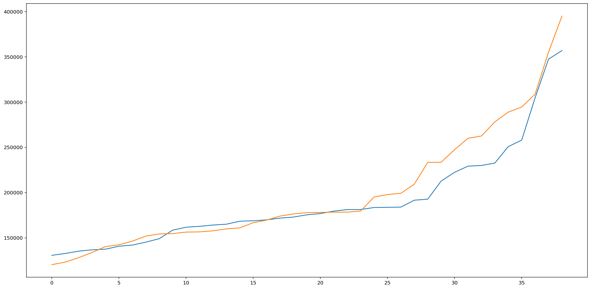

# Healthcare Cost Prediction in Hospitals with Stacked Regressions 

This case study has been developed to showcase the regression that is built using a small dataset of patients. The goal is to predict the total cost of stay in the hospital based on the patient's attributes.
<br/>
<br/>

## Data

The Data Description is mentioned in the file 'Hospital - Data Description.xlsx'. The Data is present in the file 'Hospital - Data.xlsx'.
<br/>
<br/>

## Methodology

After data cleaning, pre-processing, and preparation, a stacked regression model is developed to maximize the accuracy of the prediction.


<br/>
<br/>
<br/>


```python
import os
import pandas as pd
import numpy as np
import copy

import seaborn as sns

import sklearn.ensemble 
from sklearn.ensemble import StackingRegressor
from sklearn.impute import SimpleImputer
from sklearn.preprocessing import LabelBinarizer
from sklearn.preprocessing import MinMaxScaler
from sklearn.model_selection import train_test_split
from sklearn.linear_model import SGDRegressor
from sklearn.ensemble import BaggingRegressor, ExtraTreesRegressor
import xgboost as xgb
from sklearn.ensemble import GradientBoostingRegressor, RandomForestRegressor
import sklearn.linear_model
from sklearn.linear_model import LinearRegression, LassoLarsCV
from sklearn.metrics import mean_squared_log_error
import sklearn.svm
from sklearn.svm import SVR, LinearSVR
from sklearn.model_selection import GridSearchCV
from sklearn import preprocessing
from sklearn.linear_model import RidgeCV, LassoCV

from sklearn import linear_model
from sklearn.metrics import r2_score

import warnings


import matplotlib 
import matplotlib.pyplot as plt
%matplotlib inline
%config InlineBackend.figure_format='retina'

pd.set_option('display.max_rows', 500)
pd.set_option('display.max_columns', 500)
```


```python
df = pd.read_excel('Hospital - Data.xlsx')
```


```python
df.count()
```


    SL.                             248
    AGE                             248
    GENDER                          248
    MARITAL STATUS                  248
    KEY COMPLAINTS -CODE            212
    BODY WEIGHT                     248
    BODY HEIGHT                     248
    HR PULSE                        248
    BP -HIGH                        225
    BP-LOW                          225
    RR                              248
    PAST MEDICAL HISTORY CODE        75
    HB                              246
    UREA                            235
    CREATININE                      215
    MODE OF ARRIVAL                 248
    STATE AT THE TIME OF ARRIVAL    248
    TYPE OF ADMSN                   248
    TOTAL LENGTH OF STAY            248
    LENGTH OF STAY - ICU            248
    LENGTH OF STAY- WARD            248
    IMPLANT USED (Y/N)              248
    COST OF IMPLANT                 248
    TOTAL COST TO HOSPITAL          248
    dtype: int64


```python
df = df.set_index('SL.')
df.head()
```


<div>
<style scoped>
    .dataframe tbody tr th:only-of-type {
        vertical-align: middle;
    }

    .dataframe tbody tr th {
        vertical-align: top;
    }

    .dataframe thead th {
        text-align: right;
    }
</style>
<table border="1" class="dataframe">
  <thead>
    <tr style="text-align: right;">
      <th></th>
      <th>AGE</th>
      <th>GENDER</th>
      <th>MARITAL STATUS</th>
      <th>KEY COMPLAINTS -CODE</th>
      <th>BODY WEIGHT</th>
      <th>BODY HEIGHT</th>
      <th>HR PULSE</th>
      <th>BP -HIGH</th>
      <th>BP-LOW</th>
      <th>RR</th>
      <th>PAST MEDICAL HISTORY CODE</th>
      <th>HB</th>
      <th>UREA</th>
      <th>CREATININE</th>
      <th>MODE OF ARRIVAL</th>
      <th>STATE AT THE TIME OF ARRIVAL</th>
      <th>TYPE OF ADMSN</th>
      <th>TOTAL LENGTH OF STAY</th>
      <th>LENGTH OF STAY - ICU</th>
      <th>LENGTH OF STAY- WARD</th>
      <th>IMPLANT USED (Y/N)</th>
      <th>COST OF IMPLANT</th>
      <th>TOTAL COST TO HOSPITAL</th>
    </tr>
    <tr>
      <th>SL.</th>
      <th></th>
      <th></th>
      <th></th>
      <th></th>
      <th></th>
      <th></th>
      <th></th>
      <th></th>
      <th></th>
      <th></th>
      <th></th>
      <th></th>
      <th></th>
      <th></th>
      <th></th>
      <th></th>
      <th></th>
      <th></th>
      <th></th>
      <th></th>
      <th></th>
      <th></th>
      <th></th>
    </tr>
  </thead>
  <tbody>
    <tr>
      <th>1</th>
      <td>58.0</td>
      <td>M</td>
      <td>MARRIED</td>
      <td>other- heart</td>
      <td>49.2</td>
      <td>160</td>
      <td>118</td>
      <td>100.0</td>
      <td>80.0</td>
      <td>32</td>
      <td>NaN</td>
      <td>11.4</td>
      <td>33.0</td>
      <td>0.8</td>
      <td>AMBULANCE</td>
      <td>ALERT</td>
      <td>EMERGENCY</td>
      <td>25</td>
      <td>12</td>
      <td>13</td>
      <td>Y</td>
      <td>38000</td>
      <td>660293.0</td>
    </tr>
    <tr>
      <th>2</th>
      <td>59.0</td>
      <td>M</td>
      <td>MARRIED</td>
      <td>CAD-DVD</td>
      <td>41.0</td>
      <td>155</td>
      <td>78</td>
      <td>70.0</td>
      <td>50.0</td>
      <td>28</td>
      <td>NaN</td>
      <td>11.4</td>
      <td>95.0</td>
      <td>1.7</td>
      <td>AMBULANCE</td>
      <td>ALERT</td>
      <td>EMERGENCY</td>
      <td>41</td>
      <td>20</td>
      <td>21</td>
      <td>Y</td>
      <td>39690</td>
      <td>809130.0</td>
    </tr>
    <tr>
      <th>3</th>
      <td>82.0</td>
      <td>M</td>
      <td>MARRIED</td>
      <td>CAD-TVD</td>
      <td>46.6</td>
      <td>164</td>
      <td>100</td>
      <td>110.0</td>
      <td>80.0</td>
      <td>20</td>
      <td>Diabetes2</td>
      <td>11.8</td>
      <td>15.0</td>
      <td>0.8</td>
      <td>WALKED IN</td>
      <td>ALERT</td>
      <td>ELECTIVE</td>
      <td>18</td>
      <td>9</td>
      <td>9</td>
      <td>N</td>
      <td>0</td>
      <td>362231.0</td>
    </tr>
    <tr>
      <th>4</th>
      <td>46.0</td>
      <td>M</td>
      <td>MARRIED</td>
      <td>CAD-DVD</td>
      <td>80.0</td>
      <td>173</td>
      <td>122</td>
      <td>110.0</td>
      <td>80.0</td>
      <td>24</td>
      <td>hypertension1</td>
      <td>11.8</td>
      <td>74.0</td>
      <td>1.5</td>
      <td>AMBULANCE</td>
      <td>ALERT</td>
      <td>EMERGENCY</td>
      <td>14</td>
      <td>13</td>
      <td>1</td>
      <td>Y</td>
      <td>89450</td>
      <td>629990.0</td>
    </tr>
    <tr>
      <th>5</th>
      <td>60.0</td>
      <td>M</td>
      <td>MARRIED</td>
      <td>CAD-DVD</td>
      <td>58.0</td>
      <td>175</td>
      <td>72</td>
      <td>180.0</td>
      <td>100.0</td>
      <td>18</td>
      <td>Diabetes2</td>
      <td>10.0</td>
      <td>48.0</td>
      <td>1.9</td>
      <td>AMBULANCE</td>
      <td>ALERT</td>
      <td>EMERGENCY</td>
      <td>24</td>
      <td>12</td>
      <td>12</td>
      <td>N</td>
      <td>0</td>
      <td>444876.0</td>
    </tr>
  </tbody>
</table>
</div>


```python
df.info()
```

    <class 'pandas.core.frame.DataFrame'>
    Int64Index: 248 entries, 1 to 248
    Data columns (total 23 columns):
     #   Column                        Non-Null Count  Dtype  
    ---  ------                        --------------  -----  
     0   AGE                           248 non-null    float64
     1   GENDER                        248 non-null    object 
     2   MARITAL STATUS                248 non-null    object 
     3   KEY COMPLAINTS -CODE          212 non-null    object 
     4   BODY WEIGHT                   248 non-null    float64
     5   BODY HEIGHT                   248 non-null    int64  
     6   HR PULSE                      248 non-null    int64  
     7   BP -HIGH                      225 non-null    float64
     8   BP-LOW                        225 non-null    float64
     9   RR                            248 non-null    int64  
     10  PAST MEDICAL HISTORY CODE     75 non-null     object 
     11  HB                            246 non-null    float64
     12  UREA                          235 non-null    float64
     13  CREATININE                    215 non-null    float64
     14  MODE OF ARRIVAL               248 non-null    object 
     15  STATE AT THE TIME OF ARRIVAL  248 non-null    object 
     16  TYPE OF ADMSN                 248 non-null    object 
     17  TOTAL LENGTH OF STAY          248 non-null    int64  
     18  LENGTH OF STAY - ICU          248 non-null    int64  
     19  LENGTH OF STAY- WARD          248 non-null    int64  
     20  IMPLANT USED (Y/N)            248 non-null    object 
     21  COST OF IMPLANT               248 non-null    int64  
     22  TOTAL COST TO HOSPITAL        248 non-null    float64
    dtypes: float64(8), int64(7), object(8)
    memory usage: 46.5+ KB


```python
df.describe()
```


<div>
<style scoped>
    .dataframe tbody tr th:only-of-type {
        vertical-align: middle;
    }

    .dataframe tbody tr th {
        vertical-align: top;
    }

    .dataframe thead th {
        text-align: right;
    }
</style>
<table border="1" class="dataframe">
  <thead>
    <tr style="text-align: right;">
      <th></th>
      <th>AGE</th>
      <th>BODY WEIGHT</th>
      <th>BODY HEIGHT</th>
      <th>HR PULSE</th>
      <th>BP -HIGH</th>
      <th>BP-LOW</th>
      <th>RR</th>
      <th>HB</th>
      <th>UREA</th>
      <th>CREATININE</th>
      <th>TOTAL LENGTH OF STAY</th>
      <th>LENGTH OF STAY - ICU</th>
      <th>LENGTH OF STAY- WARD</th>
      <th>COST OF IMPLANT</th>
      <th>TOTAL COST TO HOSPITAL</th>
    </tr>
  </thead>
  <tbody>
    <tr>
      <th>count</th>
      <td>248.000000</td>
      <td>248.000000</td>
      <td>248.000000</td>
      <td>248.000000</td>
      <td>225.000000</td>
      <td>225.000000</td>
      <td>248.000000</td>
      <td>246.000000</td>
      <td>235.000000</td>
      <td>215.000000</td>
      <td>248.000000</td>
      <td>248.000000</td>
      <td>248.000000</td>
      <td>248.000000</td>
      <td>248.000000</td>
    </tr>
    <tr>
      <th>mean</th>
      <td>28.879837</td>
      <td>37.524677</td>
      <td>130.221774</td>
      <td>92.229839</td>
      <td>115.022222</td>
      <td>71.875556</td>
      <td>23.540323</td>
      <td>12.894553</td>
      <td>26.581702</td>
      <td>0.746977</td>
      <td>11.612903</td>
      <td>3.475806</td>
      <td>8.153226</td>
      <td>8544.201613</td>
      <td>198723.330282</td>
    </tr>
    <tr>
      <th>std</th>
      <td>25.899359</td>
      <td>23.118822</td>
      <td>39.170901</td>
      <td>20.308740</td>
      <td>22.536368</td>
      <td>15.313176</td>
      <td>3.840756</td>
      <td>3.083237</td>
      <td>15.998367</td>
      <td>0.548641</td>
      <td>5.392617</td>
      <td>3.853520</td>
      <td>3.755793</td>
      <td>21521.877503</td>
      <td>122587.492984</td>
    </tr>
    <tr>
      <th>min</th>
      <td>0.032877</td>
      <td>2.020000</td>
      <td>19.000000</td>
      <td>41.000000</td>
      <td>70.000000</td>
      <td>39.000000</td>
      <td>12.000000</td>
      <td>5.000000</td>
      <td>2.000000</td>
      <td>0.100000</td>
      <td>3.000000</td>
      <td>0.000000</td>
      <td>0.000000</td>
      <td>0.000000</td>
      <td>46093.000000</td>
    </tr>
    <tr>
      <th>25%</th>
      <td>6.000000</td>
      <td>15.000000</td>
      <td>105.000000</td>
      <td>78.000000</td>
      <td>100.000000</td>
      <td>60.000000</td>
      <td>22.000000</td>
      <td>11.300000</td>
      <td>18.000000</td>
      <td>0.300000</td>
      <td>8.000000</td>
      <td>1.000000</td>
      <td>6.000000</td>
      <td>0.000000</td>
      <td>131652.750000</td>
    </tr>
    <tr>
      <th>50%</th>
      <td>15.500000</td>
      <td>40.900000</td>
      <td>147.500000</td>
      <td>90.000000</td>
      <td>110.000000</td>
      <td>70.000000</td>
      <td>24.000000</td>
      <td>12.350000</td>
      <td>22.000000</td>
      <td>0.700000</td>
      <td>10.000000</td>
      <td>2.000000</td>
      <td>7.000000</td>
      <td>0.000000</td>
      <td>162660.500000</td>
    </tr>
    <tr>
      <th>75%</th>
      <td>55.000000</td>
      <td>58.250000</td>
      <td>160.000000</td>
      <td>104.000000</td>
      <td>130.000000</td>
      <td>80.000000</td>
      <td>24.000000</td>
      <td>14.000000</td>
      <td>30.000000</td>
      <td>1.000000</td>
      <td>13.000000</td>
      <td>4.000000</td>
      <td>10.000000</td>
      <td>0.000000</td>
      <td>220614.000000</td>
    </tr>
    <tr>
      <th>max</th>
      <td>88.000000</td>
      <td>85.000000</td>
      <td>185.000000</td>
      <td>155.000000</td>
      <td>215.000000</td>
      <td>140.000000</td>
      <td>42.000000</td>
      <td>25.700000</td>
      <td>143.000000</td>
      <td>5.200000</td>
      <td>41.000000</td>
      <td>30.000000</td>
      <td>22.000000</td>
      <td>196848.000000</td>
      <td>887350.000000</td>
    </tr>
  </tbody>
</table>
</div>


```python
numerical_cols = ['AGE', 'BODY WEIGHT', 'BODY HEIGHT', 'HR PULSE', 'BP -HIGH', 'BP-LOW', 'RR', 'HB', 'UREA', 
                  'CREATININE', 'TOTAL LENGTH OF STAY', 'LENGTH OF STAY - ICU', 'LENGTH OF STAY- WARD', 
                  'COST OF IMPLANT']

categorical_cols = ['GENDER', 'MARITAL STATUS', 'KEY COMPLAINTS -CODE', 'PAST MEDICAL HISTORY CODE', 
                    'MODE OF ARRIVAL', 'STATE AT THE TIME OF ARRIVAL', 'TYPE OF ADMSN', 'IMPLANT USED (Y/N)']

target_col = 'TOTAL COST TO HOSPITAL '
```


```python
df[numerical_cols].head(2)
```


<div>
<style scoped>
    .dataframe tbody tr th:only-of-type {
        vertical-align: middle;
    }

    .dataframe tbody tr th {
        vertical-align: top;
    }

    .dataframe thead th {
        text-align: right;
    }
</style>
<table border="1" class="dataframe">
  <thead>
    <tr style="text-align: right;">
      <th></th>
      <th>AGE</th>
      <th>BODY WEIGHT</th>
      <th>BODY HEIGHT</th>
      <th>HR PULSE</th>
      <th>BP -HIGH</th>
      <th>BP-LOW</th>
      <th>RR</th>
      <th>HB</th>
      <th>UREA</th>
      <th>CREATININE</th>
      <th>TOTAL LENGTH OF STAY</th>
      <th>LENGTH OF STAY - ICU</th>
      <th>LENGTH OF STAY- WARD</th>
      <th>COST OF IMPLANT</th>
    </tr>
    <tr>
      <th>SL.</th>
      <th></th>
      <th></th>
      <th></th>
      <th></th>
      <th></th>
      <th></th>
      <th></th>
      <th></th>
      <th></th>
      <th></th>
      <th></th>
      <th></th>
      <th></th>
      <th></th>
    </tr>
  </thead>
  <tbody>
    <tr>
      <th>1</th>
      <td>58.0</td>
      <td>49.2</td>
      <td>160</td>
      <td>118</td>
      <td>100.0</td>
      <td>80.0</td>
      <td>32</td>
      <td>11.4</td>
      <td>33.0</td>
      <td>0.8</td>
      <td>25</td>
      <td>12</td>
      <td>13</td>
      <td>38000</td>
    </tr>
    <tr>
      <th>2</th>
      <td>59.0</td>
      <td>41.0</td>
      <td>155</td>
      <td>78</td>
      <td>70.0</td>
      <td>50.0</td>
      <td>28</td>
      <td>11.4</td>
      <td>95.0</td>
      <td>1.7</td>
      <td>41</td>
      <td>20</td>
      <td>21</td>
      <td>39690</td>
    </tr>
  </tbody>
</table>
</div>


```python
df[categorical_cols].head(2)
```


<div>
<style scoped>
    .dataframe tbody tr th:only-of-type {
        vertical-align: middle;
    }

    .dataframe tbody tr th {
        vertical-align: top;
    }

    .dataframe thead th {
        text-align: right;
    }
</style>
<table border="1" class="dataframe">
  <thead>
    <tr style="text-align: right;">
      <th></th>
      <th>GENDER</th>
      <th>MARITAL STATUS</th>
      <th>KEY COMPLAINTS -CODE</th>
      <th>PAST MEDICAL HISTORY CODE</th>
      <th>MODE OF ARRIVAL</th>
      <th>STATE AT THE TIME OF ARRIVAL</th>
      <th>TYPE OF ADMSN</th>
      <th>IMPLANT USED (Y/N)</th>
    </tr>
    <tr>
      <th>SL.</th>
      <th></th>
      <th></th>
      <th></th>
      <th></th>
      <th></th>
      <th></th>
      <th></th>
      <th></th>
    </tr>
  </thead>
  <tbody>
    <tr>
      <th>1</th>
      <td>M</td>
      <td>MARRIED</td>
      <td>other- heart</td>
      <td>NaN</td>
      <td>AMBULANCE</td>
      <td>ALERT</td>
      <td>EMERGENCY</td>
      <td>Y</td>
    </tr>
    <tr>
      <th>2</th>
      <td>M</td>
      <td>MARRIED</td>
      <td>CAD-DVD</td>
      <td>NaN</td>
      <td>AMBULANCE</td>
      <td>ALERT</td>
      <td>EMERGENCY</td>
      <td>Y</td>
    </tr>
  </tbody>
</table>
</div>


## Generating the Correlation Matrix

Without any further processing, the correlation matrix will be computed on the numerical columns only


```python
def plot_corr(df):
    corr = df.corr()
    mask = np.triu(np.ones_like(corr, dtype=np.bool))
    f, ax = plt.subplots(figsize=(15, 15))
    cmap = sns.diverging_palette(220, 10, as_cmap=True)
    sns.heatmap(corr, mask=mask, cmap=cmap, vmax=.3, center=0, square=True, linewidths=.5, cbar_kws={"shrink": .5})

plot_corr(df)
```


# Data Exploration and Outliers Investigation 

### Noting that record #37 is likely incorrect when age is concerned

Even though weight and height indicate an adult with Type 2 Diabetes, but the age is incorrectly set to 10 months


```python
# Noting that record #37 is likely incorrect when age is concerned
df.loc[37][['AGE', 'GENDER', 'BODY WEIGHT', 'BODY HEIGHT']]
```


    AGE            0.833333
    GENDER                M
    BODY WEIGHT          78
    BODY HEIGHT         173
    Name: 37, dtype: object


An easy fix (instead of throwing away this record) is to find out what all other patients with Type 2 Diabetes have as average age, then do one more check that they have all the same range of weights and heights as #37, and then assign the average to #37


```python
df_del = df.drop([37], axis=0)
df_del[df_del['PAST MEDICAL HISTORY CODE'] == 'Diabetes2'].head(20)
```


<div>
<style scoped>
    .dataframe tbody tr th:only-of-type {
        vertical-align: middle;
    }

    .dataframe tbody tr th {
        vertical-align: top;
    }

    .dataframe thead th {
        text-align: right;
    }
</style>
<table border="1" class="dataframe">
  <thead>
    <tr style="text-align: right;">
      <th></th>
      <th>AGE</th>
      <th>GENDER</th>
      <th>MARITAL STATUS</th>
      <th>KEY COMPLAINTS -CODE</th>
      <th>BODY WEIGHT</th>
      <th>BODY HEIGHT</th>
      <th>HR PULSE</th>
      <th>BP -HIGH</th>
      <th>BP-LOW</th>
      <th>RR</th>
      <th>PAST MEDICAL HISTORY CODE</th>
      <th>HB</th>
      <th>UREA</th>
      <th>CREATININE</th>
      <th>MODE OF ARRIVAL</th>
      <th>STATE AT THE TIME OF ARRIVAL</th>
      <th>TYPE OF ADMSN</th>
      <th>TOTAL LENGTH OF STAY</th>
      <th>LENGTH OF STAY - ICU</th>
      <th>LENGTH OF STAY- WARD</th>
      <th>IMPLANT USED (Y/N)</th>
      <th>COST OF IMPLANT</th>
      <th>TOTAL COST TO HOSPITAL</th>
    </tr>
    <tr>
      <th>SL.</th>
      <th></th>
      <th></th>
      <th></th>
      <th></th>
      <th></th>
      <th></th>
      <th></th>
      <th></th>
      <th></th>
      <th></th>
      <th></th>
      <th></th>
      <th></th>
      <th></th>
      <th></th>
      <th></th>
      <th></th>
      <th></th>
      <th></th>
      <th></th>
      <th></th>
      <th></th>
      <th></th>
    </tr>
  </thead>
  <tbody>
    <tr>
      <th>3</th>
      <td>82.0</td>
      <td>M</td>
      <td>MARRIED</td>
      <td>CAD-TVD</td>
      <td>46.6</td>
      <td>164</td>
      <td>100</td>
      <td>110.0</td>
      <td>80.0</td>
      <td>20</td>
      <td>Diabetes2</td>
      <td>11.8</td>
      <td>15.0</td>
      <td>0.8</td>
      <td>WALKED IN</td>
      <td>ALERT</td>
      <td>ELECTIVE</td>
      <td>18</td>
      <td>9</td>
      <td>9</td>
      <td>N</td>
      <td>0</td>
      <td>362231.00</td>
    </tr>
    <tr>
      <th>5</th>
      <td>60.0</td>
      <td>M</td>
      <td>MARRIED</td>
      <td>CAD-DVD</td>
      <td>58.0</td>
      <td>175</td>
      <td>72</td>
      <td>180.0</td>
      <td>100.0</td>
      <td>18</td>
      <td>Diabetes2</td>
      <td>10.0</td>
      <td>48.0</td>
      <td>1.9</td>
      <td>AMBULANCE</td>
      <td>ALERT</td>
      <td>EMERGENCY</td>
      <td>24</td>
      <td>12</td>
      <td>12</td>
      <td>N</td>
      <td>0</td>
      <td>444876.00</td>
    </tr>
    <tr>
      <th>7</th>
      <td>73.0</td>
      <td>M</td>
      <td>MARRIED</td>
      <td>CAD-TVD</td>
      <td>60.0</td>
      <td>170</td>
      <td>108</td>
      <td>160.0</td>
      <td>90.0</td>
      <td>24</td>
      <td>Diabetes2</td>
      <td>14.5</td>
      <td>31.0</td>
      <td>1.6</td>
      <td>WALKED IN</td>
      <td>ALERT</td>
      <td>ELECTIVE</td>
      <td>15</td>
      <td>15</td>
      <td>0</td>
      <td>N</td>
      <td>0</td>
      <td>887350.00</td>
    </tr>
    <tr>
      <th>9</th>
      <td>72.0</td>
      <td>M</td>
      <td>MARRIED</td>
      <td>CAD-DVD</td>
      <td>72.0</td>
      <td>174</td>
      <td>95</td>
      <td>100.0</td>
      <td>50.0</td>
      <td>25</td>
      <td>Diabetes2</td>
      <td>9.6</td>
      <td>32.0</td>
      <td>1.2</td>
      <td>AMBULANCE</td>
      <td>ALERT</td>
      <td>EMERGENCY</td>
      <td>26</td>
      <td>9</td>
      <td>17</td>
      <td>N</td>
      <td>0</td>
      <td>437529.07</td>
    </tr>
    <tr>
      <th>22</th>
      <td>62.0</td>
      <td>M</td>
      <td>MARRIED</td>
      <td>CAD-TVD</td>
      <td>74.0</td>
      <td>160</td>
      <td>60</td>
      <td>160.0</td>
      <td>70.0</td>
      <td>24</td>
      <td>Diabetes2</td>
      <td>9.7</td>
      <td>31.0</td>
      <td>1.1</td>
      <td>WALKED IN</td>
      <td>ALERT</td>
      <td>ELECTIVE</td>
      <td>9</td>
      <td>8</td>
      <td>1</td>
      <td>N</td>
      <td>0</td>
      <td>288960.00</td>
    </tr>
    <tr>
      <th>25</th>
      <td>60.0</td>
      <td>F</td>
      <td>MARRIED</td>
      <td>CAD-TVD</td>
      <td>53.0</td>
      <td>155</td>
      <td>85</td>
      <td>110.0</td>
      <td>70.0</td>
      <td>30</td>
      <td>Diabetes2</td>
      <td>10.3</td>
      <td>36.0</td>
      <td>1.4</td>
      <td>AMBULANCE</td>
      <td>ALERT</td>
      <td>EMERGENCY</td>
      <td>11</td>
      <td>11</td>
      <td>0</td>
      <td>Y</td>
      <td>38000</td>
      <td>361738.00</td>
    </tr>
    <tr>
      <th>28</th>
      <td>47.0</td>
      <td>M</td>
      <td>MARRIED</td>
      <td>CAD-TVD</td>
      <td>73.1</td>
      <td>171</td>
      <td>87</td>
      <td>100.0</td>
      <td>70.0</td>
      <td>22</td>
      <td>Diabetes2</td>
      <td>14.6</td>
      <td>76.0</td>
      <td>2.3</td>
      <td>AMBULANCE</td>
      <td>ALERT</td>
      <td>EMERGENCY</td>
      <td>15</td>
      <td>6</td>
      <td>10</td>
      <td>N</td>
      <td>0</td>
      <td>278213.73</td>
    </tr>
    <tr>
      <th>188</th>
      <td>56.0</td>
      <td>M</td>
      <td>MARRIED</td>
      <td>CAD-TVD</td>
      <td>85.0</td>
      <td>173</td>
      <td>100</td>
      <td>140.0</td>
      <td>90.0</td>
      <td>20</td>
      <td>Diabetes2</td>
      <td>12.1</td>
      <td>19.0</td>
      <td>0.8</td>
      <td>WALKED IN</td>
      <td>ALERT</td>
      <td>ELECTIVE</td>
      <td>9</td>
      <td>4</td>
      <td>5</td>
      <td>N</td>
      <td>0</td>
      <td>191102.00</td>
    </tr>
  </tbody>
</table>
</div>


```python
df_del = df.drop([37], axis=0)
mean_age = df_del[df_del['PAST MEDICAL HISTORY CODE'] == 'Diabetes2']['AGE'].mean()
print(mean_age)
df.at[37, 'AGE'] = mean_age
```

    64.0


```python
df.at[37, 'AGE'] = 64
df[35:38].head()
```


<div>
<style scoped>
    .dataframe tbody tr th:only-of-type {
        vertical-align: middle;
    }

    .dataframe tbody tr th {
        vertical-align: top;
    }

    .dataframe thead th {
        text-align: right;
    }
</style>
<table border="1" class="dataframe">
  <thead>
    <tr style="text-align: right;">
      <th></th>
      <th>AGE</th>
      <th>GENDER</th>
      <th>MARITAL STATUS</th>
      <th>KEY COMPLAINTS -CODE</th>
      <th>BODY WEIGHT</th>
      <th>BODY HEIGHT</th>
      <th>HR PULSE</th>
      <th>BP -HIGH</th>
      <th>BP-LOW</th>
      <th>RR</th>
      <th>PAST MEDICAL HISTORY CODE</th>
      <th>HB</th>
      <th>UREA</th>
      <th>CREATININE</th>
      <th>MODE OF ARRIVAL</th>
      <th>STATE AT THE TIME OF ARRIVAL</th>
      <th>TYPE OF ADMSN</th>
      <th>TOTAL LENGTH OF STAY</th>
      <th>LENGTH OF STAY - ICU</th>
      <th>LENGTH OF STAY- WARD</th>
      <th>IMPLANT USED (Y/N)</th>
      <th>COST OF IMPLANT</th>
      <th>TOTAL COST TO HOSPITAL</th>
    </tr>
    <tr>
      <th>SL.</th>
      <th></th>
      <th></th>
      <th></th>
      <th></th>
      <th></th>
      <th></th>
      <th></th>
      <th></th>
      <th></th>
      <th></th>
      <th></th>
      <th></th>
      <th></th>
      <th></th>
      <th></th>
      <th></th>
      <th></th>
      <th></th>
      <th></th>
      <th></th>
      <th></th>
      <th></th>
      <th></th>
    </tr>
  </thead>
  <tbody>
    <tr>
      <th>36</th>
      <td>0.833333</td>
      <td>M</td>
      <td>UNMARRIED</td>
      <td>other- heart</td>
      <td>6.0</td>
      <td>68</td>
      <td>120</td>
      <td>NaN</td>
      <td>NaN</td>
      <td>22</td>
      <td>NaN</td>
      <td>10.4</td>
      <td>24.0</td>
      <td>0.3</td>
      <td>WALKED IN</td>
      <td>ALERT</td>
      <td>ELECTIVE</td>
      <td>32</td>
      <td>30</td>
      <td>2</td>
      <td>N</td>
      <td>0</td>
      <td>551809.0</td>
    </tr>
    <tr>
      <th>37</th>
      <td>64.000000</td>
      <td>M</td>
      <td>MARRIED</td>
      <td>CAD-TVD</td>
      <td>78.0</td>
      <td>173</td>
      <td>82</td>
      <td>130.0</td>
      <td>80.0</td>
      <td>24</td>
      <td>Diabetes2</td>
      <td>13.0</td>
      <td>82.0</td>
      <td>2.0</td>
      <td>WALKED IN</td>
      <td>ALERT</td>
      <td>ELECTIVE</td>
      <td>12</td>
      <td>5</td>
      <td>7</td>
      <td>N</td>
      <td>0</td>
      <td>293127.0</td>
    </tr>
    <tr>
      <th>38</th>
      <td>63.000000</td>
      <td>F</td>
      <td>MARRIED</td>
      <td>other- heart</td>
      <td>59.0</td>
      <td>162</td>
      <td>76</td>
      <td>150.0</td>
      <td>80.0</td>
      <td>15</td>
      <td>hypertension3</td>
      <td>12.0</td>
      <td>28.0</td>
      <td>1.0</td>
      <td>WALKED IN</td>
      <td>ALERT</td>
      <td>ELECTIVE</td>
      <td>16</td>
      <td>5</td>
      <td>11</td>
      <td>N</td>
      <td>0</td>
      <td>260036.0</td>
    </tr>
  </tbody>
</table>
</div>


```python
df[115:120].head()
```


<div>
<style scoped>
    .dataframe tbody tr th:only-of-type {
        vertical-align: middle;
    }

    .dataframe tbody tr th {
        vertical-align: top;
    }

    .dataframe thead th {
        text-align: right;
    }
</style>
<table border="1" class="dataframe">
  <thead>
    <tr style="text-align: right;">
      <th></th>
      <th>AGE</th>
      <th>GENDER</th>
      <th>MARITAL STATUS</th>
      <th>KEY COMPLAINTS -CODE</th>
      <th>BODY WEIGHT</th>
      <th>BODY HEIGHT</th>
      <th>HR PULSE</th>
      <th>BP -HIGH</th>
      <th>BP-LOW</th>
      <th>RR</th>
      <th>PAST MEDICAL HISTORY CODE</th>
      <th>HB</th>
      <th>UREA</th>
      <th>CREATININE</th>
      <th>MODE OF ARRIVAL</th>
      <th>STATE AT THE TIME OF ARRIVAL</th>
      <th>TYPE OF ADMSN</th>
      <th>TOTAL LENGTH OF STAY</th>
      <th>LENGTH OF STAY - ICU</th>
      <th>LENGTH OF STAY- WARD</th>
      <th>IMPLANT USED (Y/N)</th>
      <th>COST OF IMPLANT</th>
      <th>TOTAL COST TO HOSPITAL</th>
    </tr>
    <tr>
      <th>SL.</th>
      <th></th>
      <th></th>
      <th></th>
      <th></th>
      <th></th>
      <th></th>
      <th></th>
      <th></th>
      <th></th>
      <th></th>
      <th></th>
      <th></th>
      <th></th>
      <th></th>
      <th></th>
      <th></th>
      <th></th>
      <th></th>
      <th></th>
      <th></th>
      <th></th>
      <th></th>
      <th></th>
    </tr>
  </thead>
  <tbody>
    <tr>
      <th>116</th>
      <td>37.0</td>
      <td>M</td>
      <td>MARRIED</td>
      <td>other- heart</td>
      <td>46.0</td>
      <td>62</td>
      <td>96</td>
      <td>140.0</td>
      <td>90.0</td>
      <td>20</td>
      <td>NaN</td>
      <td>5.0</td>
      <td>NaN</td>
      <td>NaN</td>
      <td>WALKED IN</td>
      <td>ALERT</td>
      <td>ELECTIVE</td>
      <td>10</td>
      <td>2</td>
      <td>8</td>
      <td>Y</td>
      <td>56000</td>
      <td>182651.00</td>
    </tr>
    <tr>
      <th>117</th>
      <td>16.0</td>
      <td>F</td>
      <td>UNMARRIED</td>
      <td>other- heart</td>
      <td>41.0</td>
      <td>162</td>
      <td>74</td>
      <td>100.0</td>
      <td>70.0</td>
      <td>24</td>
      <td>NaN</td>
      <td>12.4</td>
      <td>19.0</td>
      <td>0.4</td>
      <td>WALKED IN</td>
      <td>ALERT</td>
      <td>ELECTIVE</td>
      <td>12</td>
      <td>2</td>
      <td>10</td>
      <td>Y</td>
      <td>77450</td>
      <td>323960.00</td>
    </tr>
    <tr>
      <th>118</th>
      <td>5.0</td>
      <td>M</td>
      <td>UNMARRIED</td>
      <td>other- heart</td>
      <td>3.3</td>
      <td>22</td>
      <td>140</td>
      <td>102.0</td>
      <td>80.0</td>
      <td>30</td>
      <td>other</td>
      <td>12.7</td>
      <td>26.0</td>
      <td>0.3</td>
      <td>WALKED IN</td>
      <td>ALERT</td>
      <td>ELECTIVE</td>
      <td>19</td>
      <td>4</td>
      <td>15</td>
      <td>N</td>
      <td>0</td>
      <td>159327.38</td>
    </tr>
    <tr>
      <th>119</th>
      <td>5.0</td>
      <td>M</td>
      <td>UNMARRIED</td>
      <td>other- respiratory</td>
      <td>15.4</td>
      <td>98</td>
      <td>123</td>
      <td>90.0</td>
      <td>50.0</td>
      <td>24</td>
      <td>NaN</td>
      <td>22.8</td>
      <td>19.0</td>
      <td>0.3</td>
      <td>WALKED IN</td>
      <td>ALERT</td>
      <td>ELECTIVE</td>
      <td>11</td>
      <td>3</td>
      <td>8</td>
      <td>N</td>
      <td>0</td>
      <td>131430.00</td>
    </tr>
    <tr>
      <th>120</th>
      <td>3.0</td>
      <td>F</td>
      <td>UNMARRIED</td>
      <td>other-tertalogy</td>
      <td>10.0</td>
      <td>85</td>
      <td>116</td>
      <td>84.0</td>
      <td>70.0</td>
      <td>24</td>
      <td>NaN</td>
      <td>18.5</td>
      <td>23.0</td>
      <td>0.3</td>
      <td>WALKED IN</td>
      <td>ALERT</td>
      <td>ELECTIVE</td>
      <td>13</td>
      <td>3</td>
      <td>10</td>
      <td>N</td>
      <td>0</td>
      <td>180415.67</td>
    </tr>
  </tbody>
</table>
</div>


## Looking for missing values


```python
missing_num_cols = []

for c in numerical_cols:
    count = len(df[df[c].isnull()])
    print('Missing Values in', c, ':', count)
    if count > 0: missing_num_cols.append(c)
```

    Missing Values in AGE : 0
    Missing Values in BODY WEIGHT : 0
    Missing Values in BODY HEIGHT : 0
    Missing Values in HR PULSE : 0
    Missing Values in BP -HIGH : 23
    Missing Values in BP-LOW : 23
    Missing Values in RR : 0
    Missing Values in HB : 2
    Missing Values in UREA : 13
    Missing Values in CREATININE : 33
    Missing Values in TOTAL LENGTH OF STAY : 0
    Missing Values in LENGTH OF STAY - ICU : 0
    Missing Values in LENGTH OF STAY- WARD : 0
    Missing Values in COST OF IMPLANT : 0


```python
for c in categorical_cols:
    print('Missing Values in', c, ':', len(df[df[c].isnull()]))
```

    Missing Values in GENDER : 0
    Missing Values in MARITAL STATUS : 0
    Missing Values in KEY COMPLAINTS -CODE : 36
    Missing Values in PAST MEDICAL HISTORY CODE : 173
    Missing Values in MODE OF ARRIVAL : 0
    Missing Values in STATE AT THE TIME OF ARRIVAL : 0
    Missing Values in TYPE OF ADMSN : 0
    Missing Values in IMPLANT USED (Y/N) : 0


### Filling in missing numerical values
For missing values in numerical columns, we can impute values, based on the median of the column. 

For missing values in categorical columns, we need to take a closer look, which we will do shortly.


```python
for c in missing_num_cols:
    imp = SimpleImputer(missing_values=np.nan, strategy='median')
    new_vals = imp.fit_transform(df[[c]])
    df[c] = new_vals
```

# Data Cleaning and Data Pre-processing

## Working on Categorical Data 

### Field "PAST MEDICAL HISTORY CODE"


```python
# noting that there many NaN values, as well as Hypertension with a capital H
df['KEY COMPLAINTS -CODE'] = df['KEY COMPLAINTS -CODE'].fillna('none')
df['KEY COMPLAINTS -CODE'].value_counts()
```


    other- heart          55
    none                  36
    CAD-DVD               27
    RHD                   26
    CAD-TVD               24
    ACHD                  19
    other-tertalogy       18
    other- respiratory    15
    OS-ASD                15
    PM-VSD                 6
    other-nervous          3
    CAD-SVD                2
    other-general          1
    CAD-VSD                1
    Name: KEY COMPLAINTS -CODE, dtype: int64


```python
# noting that there many NaN values, as well as Hypertension with a capital H
df['PAST MEDICAL HISTORY CODE'] = df['PAST MEDICAL HISTORY CODE'].fillna('none').apply(lambda x: x.lower())
df['PAST MEDICAL HISTORY CODE'].value_counts()
```


    none             173
    hypertension1     23
    other             15
    hypertension2     13
    diabetes1         10
    diabetes2          9
    hypertension3      5
    Name: PAST MEDICAL HISTORY CODE, dtype: int64


```python
df['GENDER'].value_counts()
```


    M    166
    F     82
    Name: GENDER, dtype: int64


```python
df['MARITAL STATUS'].value_counts()
```


    UNMARRIED    140
    MARRIED      108
    Name: MARITAL STATUS, dtype: int64


```python
df['MODE OF ARRIVAL'].value_counts()
```


    WALKED IN      214
    AMBULANCE       30
    TRANSFERRED      4
    Name: MODE OF ARRIVAL, dtype: int64


```python
df['TYPE OF ADMSN'].value_counts()
```


    ELECTIVE     216
    EMERGENCY     32
    Name: TYPE OF ADMSN, dtype: int64


```python
df['IMPLANT USED (Y/N)'].value_counts()
```


    N    199
    Y     49
    Name: IMPLANT USED (Y/N), dtype: int64


```python
df['STATE AT THE TIME OF ARRIVAL'].value_counts()
```


    ALERT       247
    CONFUSED      1
    Name: STATE AT THE TIME OF ARRIVAL, dtype: int64


### Revisiting the Correlation Matrix 
After taking care of the missing values, we now label-encode categorical data into numerical values, so that we can plot the correlation matrix with the categorical data.


```python
df_enc = copy.deepcopy(df)

for c in categorical_cols:
    le = preprocessing.LabelEncoder()
    df_enc[c] = le.fit_transform(df_enc[c])
    
plot_corr(df_enc)
```


#### Outlier in Categorical Data
There's only one record with the 'STATE AT THE TIME OF ARRIVAL' as 'CONFUSED', therefore not enough data for this caregory, and is very imbalanced. I think we're better off dropping this column from the data.


```python
df = df.drop('STATE AT THE TIME OF ARRIVAL', axis=1)
df.head()
```


<div>
<style scoped>
    .dataframe tbody tr th:only-of-type {
        vertical-align: middle;
    }

    .dataframe tbody tr th {
        vertical-align: top;
    }

    .dataframe thead th {
        text-align: right;
    }
</style>
<table border="1" class="dataframe">
  <thead>
    <tr style="text-align: right;">
      <th></th>
      <th>AGE</th>
      <th>GENDER</th>
      <th>MARITAL STATUS</th>
      <th>KEY COMPLAINTS -CODE</th>
      <th>BODY WEIGHT</th>
      <th>BODY HEIGHT</th>
      <th>HR PULSE</th>
      <th>BP -HIGH</th>
      <th>BP-LOW</th>
      <th>RR</th>
      <th>PAST MEDICAL HISTORY CODE</th>
      <th>HB</th>
      <th>UREA</th>
      <th>CREATININE</th>
      <th>MODE OF ARRIVAL</th>
      <th>TYPE OF ADMSN</th>
      <th>TOTAL LENGTH OF STAY</th>
      <th>LENGTH OF STAY - ICU</th>
      <th>LENGTH OF STAY- WARD</th>
      <th>IMPLANT USED (Y/N)</th>
      <th>COST OF IMPLANT</th>
      <th>TOTAL COST TO HOSPITAL</th>
    </tr>
    <tr>
      <th>SL.</th>
      <th></th>
      <th></th>
      <th></th>
      <th></th>
      <th></th>
      <th></th>
      <th></th>
      <th></th>
      <th></th>
      <th></th>
      <th></th>
      <th></th>
      <th></th>
      <th></th>
      <th></th>
      <th></th>
      <th></th>
      <th></th>
      <th></th>
      <th></th>
      <th></th>
      <th></th>
    </tr>
  </thead>
  <tbody>
    <tr>
      <th>1</th>
      <td>58.0</td>
      <td>M</td>
      <td>MARRIED</td>
      <td>other- heart</td>
      <td>49.2</td>
      <td>160</td>
      <td>118</td>
      <td>100.0</td>
      <td>80.0</td>
      <td>32</td>
      <td>none</td>
      <td>11.4</td>
      <td>33.0</td>
      <td>0.8</td>
      <td>AMBULANCE</td>
      <td>EMERGENCY</td>
      <td>25</td>
      <td>12</td>
      <td>13</td>
      <td>Y</td>
      <td>38000</td>
      <td>660293.0</td>
    </tr>
    <tr>
      <th>2</th>
      <td>59.0</td>
      <td>M</td>
      <td>MARRIED</td>
      <td>CAD-DVD</td>
      <td>41.0</td>
      <td>155</td>
      <td>78</td>
      <td>70.0</td>
      <td>50.0</td>
      <td>28</td>
      <td>none</td>
      <td>11.4</td>
      <td>95.0</td>
      <td>1.7</td>
      <td>AMBULANCE</td>
      <td>EMERGENCY</td>
      <td>41</td>
      <td>20</td>
      <td>21</td>
      <td>Y</td>
      <td>39690</td>
      <td>809130.0</td>
    </tr>
    <tr>
      <th>3</th>
      <td>82.0</td>
      <td>M</td>
      <td>MARRIED</td>
      <td>CAD-TVD</td>
      <td>46.6</td>
      <td>164</td>
      <td>100</td>
      <td>110.0</td>
      <td>80.0</td>
      <td>20</td>
      <td>diabetes2</td>
      <td>11.8</td>
      <td>15.0</td>
      <td>0.8</td>
      <td>WALKED IN</td>
      <td>ELECTIVE</td>
      <td>18</td>
      <td>9</td>
      <td>9</td>
      <td>N</td>
      <td>0</td>
      <td>362231.0</td>
    </tr>
    <tr>
      <th>4</th>
      <td>46.0</td>
      <td>M</td>
      <td>MARRIED</td>
      <td>CAD-DVD</td>
      <td>80.0</td>
      <td>173</td>
      <td>122</td>
      <td>110.0</td>
      <td>80.0</td>
      <td>24</td>
      <td>hypertension1</td>
      <td>11.8</td>
      <td>74.0</td>
      <td>1.5</td>
      <td>AMBULANCE</td>
      <td>EMERGENCY</td>
      <td>14</td>
      <td>13</td>
      <td>1</td>
      <td>Y</td>
      <td>89450</td>
      <td>629990.0</td>
    </tr>
    <tr>
      <th>5</th>
      <td>60.0</td>
      <td>M</td>
      <td>MARRIED</td>
      <td>CAD-DVD</td>
      <td>58.0</td>
      <td>175</td>
      <td>72</td>
      <td>180.0</td>
      <td>100.0</td>
      <td>18</td>
      <td>diabetes2</td>
      <td>10.0</td>
      <td>48.0</td>
      <td>1.9</td>
      <td>AMBULANCE</td>
      <td>EMERGENCY</td>
      <td>24</td>
      <td>12</td>
      <td>12</td>
      <td>N</td>
      <td>0</td>
      <td>444876.0</td>
    </tr>
  </tbody>
</table>
</div>


## Plotting the range of the target variable

We notice that the shape of the target variable (when sorted) resembles a "hockey stick", like an exponential curve, with a kink in the beginning (sub $100,000). This gives regressions a hard time in fitting the curve, and therefore it would be better if we operated on the log of the target variable


```python
plt.figure(figsize=(20,10))
plt.plot(range(0, len(df)), df[[target_col]].sort_values(target_col) )

```


    [<matplotlib.lines.Line2D at 0x11ba53550>]


By taking the log, the curve is now smoother, and has a lesser range (between 11 and 13.6, rather than 50,000 and 880,000). It is now more linear, and regressions have a better chance fitting it. 


```python
plt.figure(figsize=(20,10))
plt.plot(range(0, len(df)), np.log(df[[target_col]].sort_values(target_col)) )
```


    [<matplotlib.lines.Line2D at 0x11adc5bd0>]


```python
df.shape
```


    (248, 22)


```python
df.to_csv('cleaned.csv')
```

### Preparing the data

Preparing the data for machine learning. Splitting the data into train and test data, binarizing all categorical columns, performing min-max on numerical columns, and adding a square of all predictor numerical columns. Since the target column still follows a "hockey stick" shape, even after the log, squaring predictor columns will provide better input, since now the regression can operate on polynomial-like inputs, e.g. a * x^2 + b * x + c


```python
def data_prepare(df, add_squares=True, filter_outliers=True, 
                 lower_range=90000, higher_range=450000,
                 remove_num_cols = []):
    
    reduced_cat_cols = list(set(categorical_cols) - set(['STATE AT THE TIME OF ARRIVAL']))

    numerical_cols = ['AGE', 'BODY WEIGHT', 'BODY HEIGHT', 'HR PULSE', 'BP -HIGH', 'BP-LOW', 'RR', 'HB', 'UREA', 
                      'CREATININE', 'TOTAL LENGTH OF STAY', 'LENGTH OF STAY - ICU', 'LENGTH OF STAY- WARD', 
                      'COST OF IMPLANT']
    
    numerical_cols = list(set(numerical_cols) - set(remove_num_cols))
    
    temp_cols = []

    dfx = copy.deepcopy(df)

    if add_squares == True:
        for c in numerical_cols:
            dfx[c+'sq'] = dfx[c] * dfx[c]
            temp_cols.append(c+'sq')


    numerical_cols = numerical_cols + temp_cols
    predictors = reduced_cat_cols + numerical_cols

    if filter_outliers==True:
        dfx = dfx[dfx[target_col] <= higher_range]
        dfx = dfx[dfx[target_col] >= lower_range]

    df_train, df_test, y_train, y_test = train_test_split(dfx[predictors], dfx[target_col], 
                                                                test_size=0.2, random_state=42)

    X_train = np.zeros((df_train.shape[0],0))
    X_test = np.zeros((df_test.shape[0],0))    

    for c in reduced_cat_cols:
        labelBinarizer = LabelBinarizer()
        binCols = labelBinarizer.fit_transform(df_train[c])
        X_train = np.append(X_train, binCols, axis=1)
        binCols = labelBinarizer.transform(df_test[c])
        X_test = np.append(X_test, binCols, axis=1)


    min_max_scaler = MinMaxScaler()
    num_c = min_max_scaler.fit_transform(df_train[numerical_cols])
    X_train = np.append(X_train, num_c, axis=1)       
    num_c = min_max_scaler.transform(df_test[numerical_cols])
    X_test = np.append(X_test, num_c, axis=1)  
    
    return X_train, X_test, y_train, y_test

```

# Regression

## Training and Prediction

In here, and after multiple trials, I settled on a StackingRegressor, with member regressors of Random Forest, Extra Trees, Linear Regression, and XGBoot Regressor. The stacking of these regressors gives a really good performance. I'm tracking the R2 and Mean Squared Log Errors accuracy measures, to track performance.

I'm also using Grid Search, to look for the best combination of algorithm parameters, and to choose the best model. The plots are for the real test data (yellow), and the prediction using the test data inputs (blue).

### Target Variable Outliers


The target variable ranges from around 46,000 to 886,000. However, inspecting and visualizing the data, there are only 18 records below 90,000, and 9 records above 500,000. For the purpose of training the model, these could be considered as Outliers, and removed from the input training data, to improve the accuracy of prediction. 

This totally depends on the business case. If these values CANNOT be considered as outliers by the business case, then we do another regression training at the end of this notebook just for this.


```python
%%time 

warnings.filterwarnings('ignore')

low_correlation_columns = ['HR PULSE', 'RR', 'HB']


def get_best_fit(df, parameters, i=0, add_squares=True, filter_outliers=True, 
                 remove_num_cols = low_correlation_columns, use_grid=True, final_estimator=False):
    
    lower_range = 150000 - i * 10000
    higher_range= 400000 + i * 10000
    
    X_train, X_test, y_train, y_test = \
                    data_prepare(df, add_squares=add_squares, filter_outliers=filter_outliers, 
                                     lower_range=lower_range, higher_range=higher_range, 
                                     remove_num_cols = remove_num_cols)

    rand_state = 43
    


    estimators = [  ('rand_forest', RandomForestRegressor(random_state=rand_state)),
                    ('extra_trees', ExtraTreesRegressor(random_state=rand_state)),    
                    ('linear', LinearRegression()),
                    ('xgb', xgb.XGBRegressor(objective ='reg:squarederror', colsample_bytree = 0.2, 
                                             alpha = 10, learning_rate = 0.008))
                 ]

    if final_estimator == True:
        reg = StackingRegressor(estimators=estimators, final_estimator=LinearRegression(), passthrough=True)
    else:
        reg = StackingRegressor(estimators=estimators)
    
    if use_grid == True:
        clf = GridSearchCV(reg, parameters, verbose=10, n_jobs=4)
        clf.fit(X_train, np.log(y_train))
    else:
        reg.fit(X_train, np.log(y_train))
    
    print('Round', i+1)

    if filter_outliers == True:
            print('For Hospital Cost Range of [', lower_range, ',', higher_range, ']')

    try: 
        if use_grid == True:
            y_pred = clf.predict(X_test)
            print (clf.best_params_)
        else:
            y_pred = reg.predict(X_test)
            
        print('R2 Accuracy Score:', r2_score(y_test, np.exp(y_pred)))
        print('MSLE Accuracy Score:', mean_squared_log_error(y_test, np.exp(y_pred)))
        plt.figure(figsize=(20,10))
        plt.plot(range(0, len(y_pred)), np.sort(np.exp(y_pred), axis=0))
        plt.plot(range(0, len(y_test)), np.sort(y_test, axis=0))
        plt.show()
    except: 
        print('\n ERROR: Infinite values - no successful model')
        
    print('\n')

    
parameters = {
              'rand_forest__n_estimators':[100, 200], 
              'extra_trees__n_estimators':[100, 200],
              'xgb__n_estimators':[400, 600],
              'rand_forest__max_depth':[9, 12], 
              'extra_trees__max_depth':[16, 25], 
              'xgb__max_depth':[9, 12]
             }

for i in range(15):
    get_best_fit(df, parameters, i=i, add_squares=True, filter_outliers=True, 
                 remove_num_cols = low_correlation_columns)
    
```

    Fitting 5 folds for each of 64 candidates, totalling 320 fits


    [Parallel(n_jobs=4)]: Using backend LokyBackend with 4 concurrent workers.
    [Parallel(n_jobs=4)]: Done   5 tasks      | elapsed:    5.3s
    [Parallel(n_jobs=4)]: Done  10 tasks      | elapsed:    8.2s
    [Parallel(n_jobs=4)]: Done  17 tasks      | elapsed:   14.3s
    [Parallel(n_jobs=4)]: Done  24 tasks      | elapsed:   19.3s
    [Parallel(n_jobs=4)]: Done  33 tasks      | elapsed:   30.6s
    [Parallel(n_jobs=4)]: Done  42 tasks      | elapsed:   38.6s
    [Parallel(n_jobs=4)]: Done  53 tasks      | elapsed:   48.5s
    [Parallel(n_jobs=4)]: Done  64 tasks      | elapsed:   57.0s
    [Parallel(n_jobs=4)]: Done  77 tasks      | elapsed:  1.2min
    [Parallel(n_jobs=4)]: Done  90 tasks      | elapsed:  1.4min
    [Parallel(n_jobs=4)]: Done 105 tasks      | elapsed:  1.7min
    [Parallel(n_jobs=4)]: Done 120 tasks      | elapsed:  2.0min
    [Parallel(n_jobs=4)]: Done 137 tasks      | elapsed:  2.3min
    [Parallel(n_jobs=4)]: Done 154 tasks      | elapsed:  2.7min
    [Parallel(n_jobs=4)]: Done 173 tasks      | elapsed:  2.9min
    [Parallel(n_jobs=4)]: Done 192 tasks      | elapsed:  3.3min
    [Parallel(n_jobs=4)]: Done 213 tasks      | elapsed:  3.7min
    [Parallel(n_jobs=4)]: Done 234 tasks      | elapsed:  4.0min
    [Parallel(n_jobs=4)]: Done 257 tasks      | elapsed:  4.4min
    [Parallel(n_jobs=4)]: Done 280 tasks      | elapsed:  4.9min
    [Parallel(n_jobs=4)]: Done 305 tasks      | elapsed:  5.3min
    [Parallel(n_jobs=4)]: Done 320 out of 320 | elapsed:  5.6min finished


    Round 1
    For Hospital Cost Range of [ 150000 , 400000 ]
    {'extra_trees__max_depth': 16, 'extra_trees__n_estimators': 100, 'rand_forest__max_depth': 12, 'rand_forest__n_estimators': 200, 'xgb__max_depth': 9, 'xgb__n_estimators': 400}
    R2 Accuracy Score: 0.8160526489141195
    MSLE Accuracy Score: 0.015400626263764872


    
    
    Fitting 5 folds for each of 64 candidates, totalling 320 fits


    [Parallel(n_jobs=4)]: Using backend LokyBackend with 4 concurrent workers.
    [Parallel(n_jobs=4)]: Done   5 tasks      | elapsed:    4.6s
    [Parallel(n_jobs=4)]: Done  10 tasks      | elapsed:    7.7s
    [Parallel(n_jobs=4)]: Done  17 tasks      | elapsed:   13.2s
    [Parallel(n_jobs=4)]: Done  24 tasks      | elapsed:   17.6s
    [Parallel(n_jobs=4)]: Done  33 tasks      | elapsed:   29.1s
    [Parallel(n_jobs=4)]: Done  42 tasks      | elapsed:   35.9s
    [Parallel(n_jobs=4)]: Done  53 tasks      | elapsed:   44.4s
    [Parallel(n_jobs=4)]: Done  64 tasks      | elapsed:   52.7s
    [Parallel(n_jobs=4)]: Done  77 tasks      | elapsed:  1.1min
    [Parallel(n_jobs=4)]: Done  90 tasks      | elapsed:  1.3min
    [Parallel(n_jobs=4)]: Done 105 tasks      | elapsed:  1.6min
    [Parallel(n_jobs=4)]: Done 120 tasks      | elapsed:  1.9min
    [Parallel(n_jobs=4)]: Done 137 tasks      | elapsed:  2.2min
    [Parallel(n_jobs=4)]: Done 154 tasks      | elapsed:  2.5min
    [Parallel(n_jobs=4)]: Done 173 tasks      | elapsed:  2.8min
    [Parallel(n_jobs=4)]: Done 192 tasks      | elapsed:  3.5min
    [Parallel(n_jobs=4)]: Done 213 tasks      | elapsed:  4.1min
    [Parallel(n_jobs=4)]: Done 234 tasks      | elapsed:  5.1min
    [Parallel(n_jobs=4)]: Done 257 tasks      | elapsed:  5.8min
    [Parallel(n_jobs=4)]: Done 280 tasks      | elapsed:  6.8min
    [Parallel(n_jobs=4)]: Done 305 tasks      | elapsed:  7.4min
    [Parallel(n_jobs=4)]: Done 320 out of 320 | elapsed:  7.8min finished


    Round 2
    For Hospital Cost Range of [ 140000 , 410000 ]
    {'extra_trees__max_depth': 16, 'extra_trees__n_estimators': 200, 'rand_forest__max_depth': 9, 'rand_forest__n_estimators': 100, 'xgb__max_depth': 12, 'xgb__n_estimators': 600}
    R2 Accuracy Score: 0.6719806614341464
    MSLE Accuracy Score: 0.026774481548476906


    
    
    Fitting 5 folds for each of 64 candidates, totalling 320 fits


    [Parallel(n_jobs=4)]: Using backend LokyBackend with 4 concurrent workers.
    [Parallel(n_jobs=4)]: Done   5 tasks      | elapsed:    7.7s
    [Parallel(n_jobs=4)]: Done  10 tasks      | elapsed:   14.1s
    [Parallel(n_jobs=4)]: Done  17 tasks      | elapsed:   24.8s
    [Parallel(n_jobs=4)]: Done  24 tasks      | elapsed:   34.3s
    [Parallel(n_jobs=4)]: Done  33 tasks      | elapsed:   54.9s
    [Parallel(n_jobs=4)]: Done  42 tasks      | elapsed:  1.1min
    [Parallel(n_jobs=4)]: Done  53 tasks      | elapsed:  1.3min
    [Parallel(n_jobs=4)]: Done  64 tasks      | elapsed:  1.6min
    [Parallel(n_jobs=4)]: Done  77 tasks      | elapsed:  2.0min
    [Parallel(n_jobs=4)]: Done  90 tasks      | elapsed:  2.4min
    [Parallel(n_jobs=4)]: Done 105 tasks      | elapsed:  2.8min
    [Parallel(n_jobs=4)]: Done 120 tasks      | elapsed:  3.4min
    [Parallel(n_jobs=4)]: Done 137 tasks      | elapsed:  3.9min
    [Parallel(n_jobs=4)]: Done 154 tasks      | elapsed:  4.5min
    [Parallel(n_jobs=4)]: Done 173 tasks      | elapsed:  4.9min
    [Parallel(n_jobs=4)]: Done 192 tasks      | elapsed:  5.2min
    [Parallel(n_jobs=4)]: Done 213 tasks      | elapsed:  5.7min
    [Parallel(n_jobs=4)]: Done 234 tasks      | elapsed:  6.2min
    [Parallel(n_jobs=4)]: Done 257 tasks      | elapsed:  6.7min
    [Parallel(n_jobs=4)]: Done 280 tasks      | elapsed:  7.3min
    [Parallel(n_jobs=4)]: Done 305 tasks      | elapsed:  8.0min
    [Parallel(n_jobs=4)]: Done 320 out of 320 | elapsed:  8.5min finished


    Round 3
    For Hospital Cost Range of [ 130000 , 420000 ]
    {'extra_trees__max_depth': 16, 'extra_trees__n_estimators': 200, 'rand_forest__max_depth': 12, 'rand_forest__n_estimators': 200, 'xgb__max_depth': 9, 'xgb__n_estimators': 600}
    R2 Accuracy Score: 0.7671269462325222
    MSLE Accuracy Score: 0.01695193859723626


    
    
    Fitting 5 folds for each of 64 candidates, totalling 320 fits


    [Parallel(n_jobs=4)]: Using backend LokyBackend with 4 concurrent workers.
    [Parallel(n_jobs=4)]: Done   5 tasks      | elapsed:    8.3s
    [Parallel(n_jobs=4)]: Done  10 tasks      | elapsed:   13.5s
    [Parallel(n_jobs=4)]: Done  17 tasks      | elapsed:   23.2s
    [Parallel(n_jobs=4)]: Done  24 tasks      | elapsed:   31.4s
    [Parallel(n_jobs=4)]: Done  33 tasks      | elapsed:   53.9s
    [Parallel(n_jobs=4)]: Done  42 tasks      | elapsed:  1.1min
    [Parallel(n_jobs=4)]: Done  53 tasks      | elapsed:  1.4min
    [Parallel(n_jobs=4)]: Done  64 tasks      | elapsed:  1.7min
    [Parallel(n_jobs=4)]: Done  77 tasks      | elapsed:  2.1min
    [Parallel(n_jobs=4)]: Done  90 tasks      | elapsed:  2.6min
    [Parallel(n_jobs=4)]: Done 105 tasks      | elapsed:  3.1min
    [Parallel(n_jobs=4)]: Done 120 tasks      | elapsed:  3.6min
    [Parallel(n_jobs=4)]: Done 137 tasks      | elapsed:  4.0min
    [Parallel(n_jobs=4)]: Done 154 tasks      | elapsed:  4.6min
    [Parallel(n_jobs=4)]: Done 173 tasks      | elapsed:  5.1min
    [Parallel(n_jobs=4)]: Done 192 tasks      | elapsed:  5.6min
    [Parallel(n_jobs=4)]: Done 213 tasks      | elapsed:  6.1min
    [Parallel(n_jobs=4)]: Done 234 tasks      | elapsed:  6.8min
    [Parallel(n_jobs=4)]: Done 257 tasks      | elapsed:  7.5min
    [Parallel(n_jobs=4)]: Done 280 tasks      | elapsed:  8.6min
    [Parallel(n_jobs=4)]: Done 305 tasks      | elapsed:  9.8min
    [Parallel(n_jobs=4)]: Done 320 out of 320 | elapsed: 10.6min finished


    Round 4
    For Hospital Cost Range of [ 120000 , 430000 ]
    {'extra_trees__max_depth': 25, 'extra_trees__n_estimators': 100, 'rand_forest__max_depth': 12, 'rand_forest__n_estimators': 100, 'xgb__max_depth': 9, 'xgb__n_estimators': 600}
    R2 Accuracy Score: 0.7657133544853764
    MSLE Accuracy Score: 0.016082260939860416





    
    
    Fitting 5 folds for each of 64 candidates, totalling 320 fits


    [Parallel(n_jobs=4)]: Using backend LokyBackend with 4 concurrent workers.
    [Parallel(n_jobs=4)]: Done   5 tasks      | elapsed:   12.1s
    [Parallel(n_jobs=4)]: Done  10 tasks      | elapsed:   18.2s
    [Parallel(n_jobs=4)]: Done  17 tasks      | elapsed:   30.1s
    [Parallel(n_jobs=4)]: Done  24 tasks      | elapsed:   40.9s
    [Parallel(n_jobs=4)]: Done  33 tasks      | elapsed:  1.2min
    [Parallel(n_jobs=4)]: Done  42 tasks      | elapsed:  1.5min
    [Parallel(n_jobs=4)]: Done  53 tasks      | elapsed:  2.0min
    [Parallel(n_jobs=4)]: Done  64 tasks      | elapsed:  2.3min
    [Parallel(n_jobs=4)]: Done  77 tasks      | elapsed:  2.8min
    [Parallel(n_jobs=4)]: Done  90 tasks      | elapsed:  3.2min
    [Parallel(n_jobs=4)]: Done 105 tasks      | elapsed:  3.8min
    [Parallel(n_jobs=4)]: Done 120 tasks      | elapsed:  4.6min
    [Parallel(n_jobs=4)]: Done 137 tasks      | elapsed:  5.1min
    [Parallel(n_jobs=4)]: Done 154 tasks      | elapsed:  6.0min
    [Parallel(n_jobs=4)]: Done 173 tasks      | elapsed:  6.5min
    [Parallel(n_jobs=4)]: Done 192 tasks      | elapsed:  7.2min
    [Parallel(n_jobs=4)]: Done 213 tasks      | elapsed:  7.9min
    [Parallel(n_jobs=4)]: Done 234 tasks      | elapsed:  8.6min
    [Parallel(n_jobs=4)]: Done 257 tasks      | elapsed:  9.3min
    [Parallel(n_jobs=4)]: Done 280 tasks      | elapsed: 10.5min
    [Parallel(n_jobs=4)]: Done 305 tasks      | elapsed: 11.5min
    [Parallel(n_jobs=4)]: Done 320 out of 320 | elapsed: 12.1min finished


    Round 5
    For Hospital Cost Range of [ 110000 , 440000 ]
    {'extra_trees__max_depth': 25, 'extra_trees__n_estimators': 100, 'rand_forest__max_depth': 9, 'rand_forest__n_estimators': 100, 'xgb__max_depth': 12, 'xgb__n_estimators': 600}
    R2 Accuracy Score: 0.8256945140065104
    MSLE Accuracy Score: 0.016567384725996722


    
    
    Fitting 5 folds for each of 64 candidates, totalling 320 fits


    [Parallel(n_jobs=4)]: Using backend LokyBackend with 4 concurrent workers.
    [Parallel(n_jobs=4)]: Done   5 tasks      | elapsed:    8.4s
    [Parallel(n_jobs=4)]: Done  10 tasks      | elapsed:   15.0s
    [Parallel(n_jobs=4)]: Done  17 tasks      | elapsed:   26.5s
    [Parallel(n_jobs=4)]: Done  24 tasks      | elapsed:   35.8s
    [Parallel(n_jobs=4)]: Done  33 tasks      | elapsed:   58.4s
    [Parallel(n_jobs=4)]: Done  42 tasks      | elapsed:  1.2min
    [Parallel(n_jobs=4)]: Done  53 tasks      | elapsed:  1.4min
    [Parallel(n_jobs=4)]: Done  64 tasks      | elapsed:  1.7min
    [Parallel(n_jobs=4)]: Done  77 tasks      | elapsed:  2.1min
    [Parallel(n_jobs=4)]: Done  90 tasks      | elapsed:  2.6min
    [Parallel(n_jobs=4)]: Done 105 tasks      | elapsed:  3.2min
    [Parallel(n_jobs=4)]: Done 120 tasks      | elapsed:  4.0min
    [Parallel(n_jobs=4)]: Done 137 tasks      | elapsed:  4.7min
    [Parallel(n_jobs=4)]: Done 154 tasks      | elapsed:  5.5min
    [Parallel(n_jobs=4)]: Done 173 tasks      | elapsed:  6.1min
    [Parallel(n_jobs=4)]: Done 192 tasks      | elapsed:  6.6min
    [Parallel(n_jobs=4)]: Done 213 tasks      | elapsed:  7.3min
    [Parallel(n_jobs=4)]: Done 234 tasks      | elapsed:  8.0min
    [Parallel(n_jobs=4)]: Done 257 tasks      | elapsed:  8.8min
    [Parallel(n_jobs=4)]: Done 280 tasks      | elapsed: 10.0min
    [Parallel(n_jobs=4)]: Done 305 tasks      | elapsed: 11.1min
    [Parallel(n_jobs=4)]: Done 320 out of 320 | elapsed: 12.1min finished


    Round 6
    For Hospital Cost Range of [ 100000 , 450000 ]
    {'extra_trees__max_depth': 25, 'extra_trees__n_estimators': 100, 'rand_forest__max_depth': 12, 'rand_forest__n_estimators': 200, 'xgb__max_depth': 9, 'xgb__n_estimators': 600}
    R2 Accuracy Score: 0.8566121553081357
    MSLE Accuracy Score: 0.01591664241459498


    
    
    Fitting 5 folds for each of 64 candidates, totalling 320 fits


    [Parallel(n_jobs=4)]: Using backend LokyBackend with 4 concurrent workers.
    [Parallel(n_jobs=4)]: Done   5 tasks      | elapsed:   13.2s
    [Parallel(n_jobs=4)]: Done  10 tasks      | elapsed:   22.4s
    [Parallel(n_jobs=4)]: Done  17 tasks      | elapsed:   36.8s
    [Parallel(n_jobs=4)]: Done  24 tasks      | elapsed:   48.9s
    [Parallel(n_jobs=4)]: Done  33 tasks      | elapsed:  1.2min
    [Parallel(n_jobs=4)]: Done  42 tasks      | elapsed:  1.4min
    [Parallel(n_jobs=4)]: Done  53 tasks      | elapsed:  1.7min
    [Parallel(n_jobs=4)]: Done  64 tasks      | elapsed:  2.1min
    [Parallel(n_jobs=4)]: Done  77 tasks      | elapsed:  2.6min
    [Parallel(n_jobs=4)]: Done  90 tasks      | elapsed:  3.1min
    [Parallel(n_jobs=4)]: Done 105 tasks      | elapsed:  3.7min
    [Parallel(n_jobs=4)]: Done 120 tasks      | elapsed:  4.3min
    [Parallel(n_jobs=4)]: Done 137 tasks      | elapsed:  5.0min
    [Parallel(n_jobs=4)]: Done 154 tasks      | elapsed:  5.6min
    [Parallel(n_jobs=4)]: Done 173 tasks      | elapsed:  6.1min
    [Parallel(n_jobs=4)]: Done 192 tasks      | elapsed:  6.6min
    [Parallel(n_jobs=4)]: Done 213 tasks      | elapsed:  7.3min
    [Parallel(n_jobs=4)]: Done 234 tasks      | elapsed:  7.9min
    [Parallel(n_jobs=4)]: Done 257 tasks      | elapsed:  8.8min
    [Parallel(n_jobs=4)]: Done 280 tasks      | elapsed:  9.6min
    [Parallel(n_jobs=4)]: Done 305 tasks      | elapsed: 10.4min
    [Parallel(n_jobs=4)]: Done 320 out of 320 | elapsed: 11.0min finished


    Round 7
    For Hospital Cost Range of [ 90000 , 460000 ]
    {'extra_trees__max_depth': 25, 'extra_trees__n_estimators': 100, 'rand_forest__max_depth': 12, 'rand_forest__n_estimators': 100, 'xgb__max_depth': 12, 'xgb__n_estimators': 600}
    R2 Accuracy Score: 0.9179251420280404
    MSLE Accuracy Score: 0.015499037917375768


    
    
    Fitting 5 folds for each of 64 candidates, totalling 320 fits


    [Parallel(n_jobs=4)]: Using backend LokyBackend with 4 concurrent workers.
    [Parallel(n_jobs=4)]: Done   5 tasks      | elapsed:    9.2s
    [Parallel(n_jobs=4)]: Done  10 tasks      | elapsed:   15.4s
    [Parallel(n_jobs=4)]: Done  17 tasks      | elapsed:   27.4s
    [Parallel(n_jobs=4)]: Done  24 tasks      | elapsed:   37.5s
    [Parallel(n_jobs=4)]: Done  33 tasks      | elapsed:  1.0min
    [Parallel(n_jobs=4)]: Done  42 tasks      | elapsed:  1.3min
    [Parallel(n_jobs=4)]: Done  53 tasks      | elapsed:  1.8min
    [Parallel(n_jobs=4)]: Done  64 tasks      | elapsed:  2.2min
    [Parallel(n_jobs=4)]: Done  77 tasks      | elapsed:  2.8min
    [Parallel(n_jobs=4)]: Done  90 tasks      | elapsed:  3.2min
    [Parallel(n_jobs=4)]: Done 105 tasks      | elapsed:  3.9min
    [Parallel(n_jobs=4)]: Done 120 tasks      | elapsed:  4.6min
    [Parallel(n_jobs=4)]: Done 137 tasks      | elapsed:  5.1min
    [Parallel(n_jobs=4)]: Done 154 tasks      | elapsed:  6.0min
    [Parallel(n_jobs=4)]: Done 173 tasks      | elapsed:  6.4min
    [Parallel(n_jobs=4)]: Done 192 tasks      | elapsed:  6.9min
    [Parallel(n_jobs=4)]: Done 213 tasks      | elapsed:  7.3min
    [Parallel(n_jobs=4)]: Done 234 tasks      | elapsed:  7.9min
    [Parallel(n_jobs=4)]: Done 257 tasks      | elapsed:  8.4min
    [Parallel(n_jobs=4)]: Done 280 tasks      | elapsed:  9.1min
    [Parallel(n_jobs=4)]: Done 305 tasks      | elapsed:  9.7min
    [Parallel(n_jobs=4)]: Done 320 out of 320 | elapsed: 10.2min finished


    Round 8
    For Hospital Cost Range of [ 80000 , 470000 ]
    {'extra_trees__max_depth': 25, 'extra_trees__n_estimators': 200, 'rand_forest__max_depth': 12, 'rand_forest__n_estimators': 100, 'xgb__max_depth': 9, 'xgb__n_estimators': 400}
    R2 Accuracy Score: 0.8488050510039987
    MSLE Accuracy Score: 0.022423653736292133


    
    
    Fitting 5 folds for each of 64 candidates, totalling 320 fits


    [Parallel(n_jobs=4)]: Using backend LokyBackend with 4 concurrent workers.
    [Parallel(n_jobs=4)]: Done   5 tasks      | elapsed:    6.4s
    [Parallel(n_jobs=4)]: Done  10 tasks      | elapsed:   10.8s
    [Parallel(n_jobs=4)]: Done  17 tasks      | elapsed:   19.1s
    [Parallel(n_jobs=4)]: Done  24 tasks      | elapsed:   26.4s
    [Parallel(n_jobs=4)]: Done  33 tasks      | elapsed:   42.2s
    [Parallel(n_jobs=4)]: Done  42 tasks      | elapsed:   52.3s
    [Parallel(n_jobs=4)]: Done  53 tasks      | elapsed:  1.1min
    [Parallel(n_jobs=4)]: Done  64 tasks      | elapsed:  1.3min
    [Parallel(n_jobs=4)]: Done  77 tasks      | elapsed:  1.6min
    [Parallel(n_jobs=4)]: Done  90 tasks      | elapsed:  1.9min
    [Parallel(n_jobs=4)]: Done 105 tasks      | elapsed:  2.4min
    [Parallel(n_jobs=4)]: Done 120 tasks      | elapsed:  2.9min
    [Parallel(n_jobs=4)]: Done 137 tasks      | elapsed:  3.3min
    [Parallel(n_jobs=4)]: Done 154 tasks      | elapsed:  3.9min
    [Parallel(n_jobs=4)]: Done 173 tasks      | elapsed:  4.3min
    [Parallel(n_jobs=4)]: Done 192 tasks      | elapsed:  4.7min
    [Parallel(n_jobs=4)]: Done 213 tasks      | elapsed:  5.1min
    [Parallel(n_jobs=4)]: Done 234 tasks      | elapsed:  5.7min
    [Parallel(n_jobs=4)]: Done 257 tasks      | elapsed:  6.2min
    [Parallel(n_jobs=4)]: Done 280 tasks      | elapsed:  6.9min
    [Parallel(n_jobs=4)]: Done 305 tasks      | elapsed:  7.6min
    [Parallel(n_jobs=4)]: Done 320 out of 320 | elapsed:  8.0min finished


    Round 9
    For Hospital Cost Range of [ 70000 , 480000 ]
    {'extra_trees__max_depth': 25, 'extra_trees__n_estimators': 100, 'rand_forest__max_depth': 12, 'rand_forest__n_estimators': 200, 'xgb__max_depth': 12, 'xgb__n_estimators': 600}
    R2 Accuracy Score: 0.8143387339325779
    MSLE Accuracy Score: 0.02178475241890849


    
    
    Fitting 5 folds for each of 64 candidates, totalling 320 fits


    [Parallel(n_jobs=4)]: Using backend LokyBackend with 4 concurrent workers.
    [Parallel(n_jobs=4)]: Done   5 tasks      | elapsed:    6.9s
    [Parallel(n_jobs=4)]: Done  10 tasks      | elapsed:   11.5s
    [Parallel(n_jobs=4)]: Done  17 tasks      | elapsed:   20.2s
    [Parallel(n_jobs=4)]: Done  24 tasks      | elapsed:   27.7s
    [Parallel(n_jobs=4)]: Done  33 tasks      | elapsed:   44.4s
    [Parallel(n_jobs=4)]: Done  42 tasks      | elapsed:   55.7s
    [Parallel(n_jobs=4)]: Done  53 tasks      | elapsed:  1.2min
    [Parallel(n_jobs=4)]: Done  64 tasks      | elapsed:  1.6min
    [Parallel(n_jobs=4)]: Done  77 tasks      | elapsed:  2.0min
    [Parallel(n_jobs=4)]: Done  90 tasks      | elapsed:  2.4min
    [Parallel(n_jobs=4)]: Done 105 tasks      | elapsed:  2.8min
    [Parallel(n_jobs=4)]: Done 120 tasks      | elapsed:  3.4min
    [Parallel(n_jobs=4)]: Done 137 tasks      | elapsed:  3.8min
    [Parallel(n_jobs=4)]: Done 154 tasks      | elapsed:  4.4min
    [Parallel(n_jobs=4)]: Done 173 tasks      | elapsed:  4.8min
    [Parallel(n_jobs=4)]: Done 192 tasks      | elapsed:  5.2min
    [Parallel(n_jobs=4)]: Done 213 tasks      | elapsed:  5.7min
    [Parallel(n_jobs=4)]: Done 234 tasks      | elapsed:  6.5min
    [Parallel(n_jobs=4)]: Done 257 tasks      | elapsed:  7.3min
    [Parallel(n_jobs=4)]: Done 280 tasks      | elapsed:  8.7min
    [Parallel(n_jobs=4)]: Done 305 tasks      | elapsed: 10.3min
    [Parallel(n_jobs=4)]: Done 320 out of 320 | elapsed: 11.1min finished


    Round 10
    For Hospital Cost Range of [ 60000 , 490000 ]
    {'extra_trees__max_depth': 25, 'extra_trees__n_estimators': 100, 'rand_forest__max_depth': 9, 'rand_forest__n_estimators': 200, 'xgb__max_depth': 9, 'xgb__n_estimators': 600}
    R2 Accuracy Score: 0.7676509172488672
    MSLE Accuracy Score: 0.031190625137066844


    
    
    Fitting 5 folds for each of 64 candidates, totalling 320 fits


    [Parallel(n_jobs=4)]: Using backend LokyBackend with 4 concurrent workers.
    [Parallel(n_jobs=4)]: Done   5 tasks      | elapsed:   12.4s
    [Parallel(n_jobs=4)]: Done  10 tasks      | elapsed:   22.0s
    [Parallel(n_jobs=4)]: Done  17 tasks      | elapsed:   40.7s
    [Parallel(n_jobs=4)]: Done  24 tasks      | elapsed:   55.3s
    [Parallel(n_jobs=4)]: Done  33 tasks      | elapsed:  1.5min
    [Parallel(n_jobs=4)]: Done  42 tasks      | elapsed:  1.8min
    [Parallel(n_jobs=4)]: Done  53 tasks      | elapsed:  2.3min
    [Parallel(n_jobs=4)]: Done  64 tasks      | elapsed:  2.8min
    [Parallel(n_jobs=4)]: Done  77 tasks      | elapsed:  3.4min
    [Parallel(n_jobs=4)]: Done  90 tasks      | elapsed:  3.9min
    [Parallel(n_jobs=4)]: Done 105 tasks      | elapsed:  4.5min
    [Parallel(n_jobs=4)]: Done 120 tasks      | elapsed:  5.4min
    [Parallel(n_jobs=4)]: Done 137 tasks      | elapsed:  5.9min
    [Parallel(n_jobs=4)]: Done 154 tasks      | elapsed:  7.0min
    [Parallel(n_jobs=4)]: Done 173 tasks      | elapsed:  7.6min
    [Parallel(n_jobs=4)]: Done 192 tasks      | elapsed:  8.3min
    [Parallel(n_jobs=4)]: Done 213 tasks      | elapsed:  9.2min
    [Parallel(n_jobs=4)]: Done 234 tasks      | elapsed: 10.3min
    [Parallel(n_jobs=4)]: Done 257 tasks      | elapsed: 11.7min
    [Parallel(n_jobs=4)]: Done 280 tasks      | elapsed: 13.4min
    [Parallel(n_jobs=4)]: Done 305 tasks      | elapsed: 14.7min
    [Parallel(n_jobs=4)]: Done 320 out of 320 | elapsed: 15.5min finished


    Round 11
    For Hospital Cost Range of [ 50000 , 500000 ]
    {'extra_trees__max_depth': 25, 'extra_trees__n_estimators': 200, 'rand_forest__max_depth': 12, 'rand_forest__n_estimators': 200, 'xgb__max_depth': 9, 'xgb__n_estimators': 600}
    R2 Accuracy Score: 0.8829479877721556
    MSLE Accuracy Score: 0.03342031002057433


    
    
    Fitting 5 folds for each of 64 candidates, totalling 320 fits


    [Parallel(n_jobs=4)]: Using backend LokyBackend with 4 concurrent workers.
    [Parallel(n_jobs=4)]: Done   5 tasks      | elapsed:   12.3s
    [Parallel(n_jobs=4)]: Done  10 tasks      | elapsed:   23.0s
    [Parallel(n_jobs=4)]: Done  17 tasks      | elapsed:   39.2s
    [Parallel(n_jobs=4)]: Done  24 tasks      | elapsed:   52.7s
    [Parallel(n_jobs=4)]: Done  33 tasks      | elapsed:  1.6min
    [Parallel(n_jobs=4)]: Done  42 tasks      | elapsed:  1.9min
    [Parallel(n_jobs=4)]: Done  53 tasks      | elapsed:  2.3min
    [Parallel(n_jobs=4)]: Done  64 tasks      | elapsed:  2.9min
    [Parallel(n_jobs=4)]: Done  77 tasks      | elapsed:  3.9min
    [Parallel(n_jobs=4)]: Done  90 tasks      | elapsed:  4.6min
    [Parallel(n_jobs=4)]: Done 105 tasks      | elapsed:  5.4min
    [Parallel(n_jobs=4)]: Done 120 tasks      | elapsed:  6.2min
    [Parallel(n_jobs=4)]: Done 137 tasks      | elapsed:  6.9min
    [Parallel(n_jobs=4)]: Done 154 tasks      | elapsed:  7.9min
    [Parallel(n_jobs=4)]: Done 173 tasks      | elapsed:  8.7min
    [Parallel(n_jobs=4)]: Done 192 tasks      | elapsed:  9.9min
    [Parallel(n_jobs=4)]: Done 213 tasks      | elapsed: 11.3min
    [Parallel(n_jobs=4)]: Done 234 tasks      | elapsed: 12.9min
    [Parallel(n_jobs=4)]: Done 257 tasks      | elapsed: 14.1min
    [Parallel(n_jobs=4)]: Done 280 tasks      | elapsed: 16.0min
    [Parallel(n_jobs=4)]: Done 305 tasks      | elapsed: 17.5min
    [Parallel(n_jobs=4)]: Done 320 out of 320 | elapsed: 18.3min finished


    Round 12
    For Hospital Cost Range of [ 40000 , 510000 ]
    {'extra_trees__max_depth': 16, 'extra_trees__n_estimators': 100, 'rand_forest__max_depth': 9, 'rand_forest__n_estimators': 100, 'xgb__max_depth': 12, 'xgb__n_estimators': 600}
    R2 Accuracy Score: 0.7913517506240078
    MSLE Accuracy Score: 0.042866519748927745


    
    
    Fitting 5 folds for each of 64 candidates, totalling 320 fits


    [Parallel(n_jobs=4)]: Using backend LokyBackend with 4 concurrent workers.
    [Parallel(n_jobs=4)]: Done   5 tasks      | elapsed:   11.5s
    [Parallel(n_jobs=4)]: Done  10 tasks      | elapsed:   19.1s
    [Parallel(n_jobs=4)]: Done  17 tasks      | elapsed:   33.2s
    [Parallel(n_jobs=4)]: Done  24 tasks      | elapsed:   43.2s
    [Parallel(n_jobs=4)]: Done  33 tasks      | elapsed:  1.1min
    [Parallel(n_jobs=4)]: Done  42 tasks      | elapsed:  1.5min
    [Parallel(n_jobs=4)]: Done  53 tasks      | elapsed:  1.9min
    [Parallel(n_jobs=4)]: Done  64 tasks      | elapsed:  2.2min
    [Parallel(n_jobs=4)]: Done  77 tasks      | elapsed:  2.7min
    [Parallel(n_jobs=4)]: Done  90 tasks      | elapsed:  3.2min
    [Parallel(n_jobs=4)]: Done 105 tasks      | elapsed:  3.8min
    [Parallel(n_jobs=4)]: Done 120 tasks      | elapsed:  4.4min
    [Parallel(n_jobs=4)]: Done 137 tasks      | elapsed:  4.8min
    [Parallel(n_jobs=4)]: Done 154 tasks      | elapsed:  5.4min
    [Parallel(n_jobs=4)]: Done 173 tasks      | elapsed:  5.8min
    [Parallel(n_jobs=4)]: Done 192 tasks      | elapsed:  6.2min
    [Parallel(n_jobs=4)]: Done 213 tasks      | elapsed:  6.7min
    [Parallel(n_jobs=4)]: Done 234 tasks      | elapsed:  7.3min
    [Parallel(n_jobs=4)]: Done 257 tasks      | elapsed:  8.0min
    [Parallel(n_jobs=4)]: Done 280 tasks      | elapsed:  8.9min
    [Parallel(n_jobs=4)]: Done 305 tasks      | elapsed:  9.7min
    [Parallel(n_jobs=4)]: Done 320 out of 320 | elapsed: 10.4min finished


    Round 13
    For Hospital Cost Range of [ 30000 , 520000 ]
    {'extra_trees__max_depth': 25, 'extra_trees__n_estimators': 100, 'rand_forest__max_depth': 12, 'rand_forest__n_estimators': 100, 'xgb__max_depth': 9, 'xgb__n_estimators': 400}
    R2 Accuracy Score: 0.8070891938991146
    MSLE Accuracy Score: 0.040223786336571234


    
    
    Fitting 5 folds for each of 64 candidates, totalling 320 fits


    [Parallel(n_jobs=4)]: Using backend LokyBackend with 4 concurrent workers.
    [Parallel(n_jobs=4)]: Done   5 tasks      | elapsed:    8.9s
    [Parallel(n_jobs=4)]: Done  10 tasks      | elapsed:   14.3s
    [Parallel(n_jobs=4)]: Done  17 tasks      | elapsed:   32.9s
    [Parallel(n_jobs=4)]: Done  24 tasks      | elapsed:   43.5s
    [Parallel(n_jobs=4)]: Done  33 tasks      | elapsed:  1.1min
    [Parallel(n_jobs=4)]: Done  42 tasks      | elapsed:  1.4min
    [Parallel(n_jobs=4)]: Done  53 tasks      | elapsed:  1.7min
    [Parallel(n_jobs=4)]: Done  64 tasks      | elapsed:  2.1min
    [Parallel(n_jobs=4)]: Done  77 tasks      | elapsed:  2.7min
    [Parallel(n_jobs=4)]: Done  90 tasks      | elapsed:  3.2min
    [Parallel(n_jobs=4)]: Done 105 tasks      | elapsed:  3.9min
    [Parallel(n_jobs=4)]: Done 120 tasks      | elapsed:  4.8min
    [Parallel(n_jobs=4)]: Done 137 tasks      | elapsed:  5.6min
    [Parallel(n_jobs=4)]: Done 154 tasks      | elapsed:  6.6min
    [Parallel(n_jobs=4)]: Done 173 tasks      | elapsed:  7.6min
    [Parallel(n_jobs=4)]: Done 192 tasks      | elapsed:  8.5min
    [Parallel(n_jobs=4)]: Done 213 tasks      | elapsed:  9.4min
    [Parallel(n_jobs=4)]: Done 234 tasks      | elapsed: 10.4min
    [Parallel(n_jobs=4)]: Done 257 tasks      | elapsed: 11.7min
    [Parallel(n_jobs=4)]: Done 280 tasks      | elapsed: 13.3min
    [Parallel(n_jobs=4)]: Done 305 tasks      | elapsed: 14.5min
    [Parallel(n_jobs=4)]: Done 320 out of 320 | elapsed: 15.4min finished


    Round 14
    For Hospital Cost Range of [ 20000 , 530000 ]
    {'extra_trees__max_depth': 25, 'extra_trees__n_estimators': 100, 'rand_forest__max_depth': 12, 'rand_forest__n_estimators': 100, 'xgb__max_depth': 9, 'xgb__n_estimators': 400}
    R2 Accuracy Score: 0.8070891938991146
    MSLE Accuracy Score: 0.040223786336571234


    
    
    Fitting 5 folds for each of 64 candidates, totalling 320 fits


    [Parallel(n_jobs=4)]: Using backend LokyBackend with 4 concurrent workers.
    [Parallel(n_jobs=4)]: Done   5 tasks      | elapsed:   10.9s
    [Parallel(n_jobs=4)]: Done  10 tasks      | elapsed:   19.3s
    [Parallel(n_jobs=4)]: Done  17 tasks      | elapsed:   37.6s
    [Parallel(n_jobs=4)]: Done  24 tasks      | elapsed:   50.7s
    [Parallel(n_jobs=4)]: Done  33 tasks      | elapsed:  1.4min
    [Parallel(n_jobs=4)]: Done  42 tasks      | elapsed:  1.6min
    [Parallel(n_jobs=4)]: Done  53 tasks      | elapsed:  2.1min
    [Parallel(n_jobs=4)]: Done  64 tasks      | elapsed:  2.6min
    [Parallel(n_jobs=4)]: Done  77 tasks      | elapsed:  3.3min
    [Parallel(n_jobs=4)]: Done  90 tasks      | elapsed:  3.9min
    [Parallel(n_jobs=4)]: Done 105 tasks      | elapsed:  4.7min
    [Parallel(n_jobs=4)]: Done 120 tasks      | elapsed:  5.5min
    [Parallel(n_jobs=4)]: Done 137 tasks      | elapsed:  6.2min
    [Parallel(n_jobs=4)]: Done 154 tasks      | elapsed:  7.1min
    [Parallel(n_jobs=4)]: Done 173 tasks      | elapsed:  7.7min
    [Parallel(n_jobs=4)]: Done 192 tasks      | elapsed:  8.6min
    [Parallel(n_jobs=4)]: Done 213 tasks      | elapsed:  9.2min
    [Parallel(n_jobs=4)]: Done 234 tasks      | elapsed:  9.9min
    [Parallel(n_jobs=4)]: Done 257 tasks      | elapsed: 10.8min
    [Parallel(n_jobs=4)]: Done 280 tasks      | elapsed: 11.8min
    [Parallel(n_jobs=4)]: Done 305 tasks      | elapsed: 12.8min
    [Parallel(n_jobs=4)]: Done 320 out of 320 | elapsed: 13.4min finished


    Round 15
    For Hospital Cost Range of [ 10000 , 540000 ]
    {'extra_trees__max_depth': 25, 'extra_trees__n_estimators': 100, 'rand_forest__max_depth': 12, 'rand_forest__n_estimators': 100, 'xgb__max_depth': 12, 'xgb__n_estimators': 400}
    
     ERROR: Infinite values - no successful model
    
    
    CPU times: user 2min 13s, sys: 4.55 s, total: 2min 18s
    Wall time: 2h 51min 34s


## Regression on the full range of the Target Variable


```python
%%time 

parameters = {
              'rand_forest__n_estimators':[100], 
              'extra_trees__n_estimators':[100,],
              'xgb__n_estimators':[200],
              'rand_forest__max_depth':[12], 
              'extra_trees__max_depth':[12], 
              'xgb__max_depth':[12]
             }    
    
    
get_best_fit(df, parameters, add_squares=True, filter_outliers=False, 
             remove_num_cols = [], use_grid=False, final_estimator=True)
    
```

    Round 1
    R2 Accuracy Score: 0.7247472595985966
    MSLE Accuracy Score: 0.05723347536052097


    
    
    CPU times: user 4.04 s, sys: 288 ms, total: 4.32 s
    Wall time: 3.4 s


```python

```
